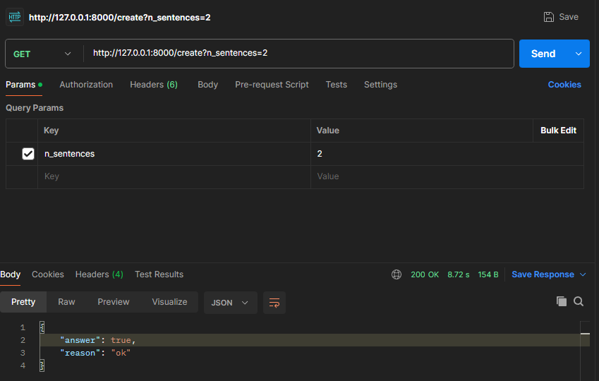
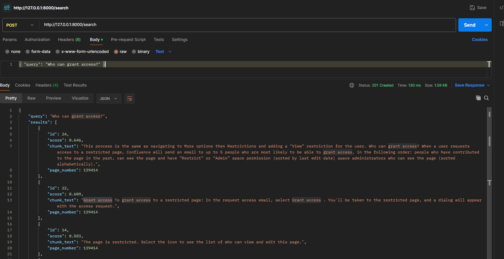

# Мини-сервис семантического поиска

*Цель:*  собрать небольшой API-сервис на Python + Litestar, который делает семантический поиск по данным полученным из документации Confluence. 

# Возможности
* GET /create — собрать страницу, разбить на чанки по N предложений, посчитать эмбеддинги и записать в Qdrant.

* POST /search — смысловой поиск по чанкам, возвращает top-5 (id, score, chunk_text, page_number).

# Запуск
Билдим контейнер
```
docker compose up --build
```

# Пример использования
* GET /create


* POST /search
